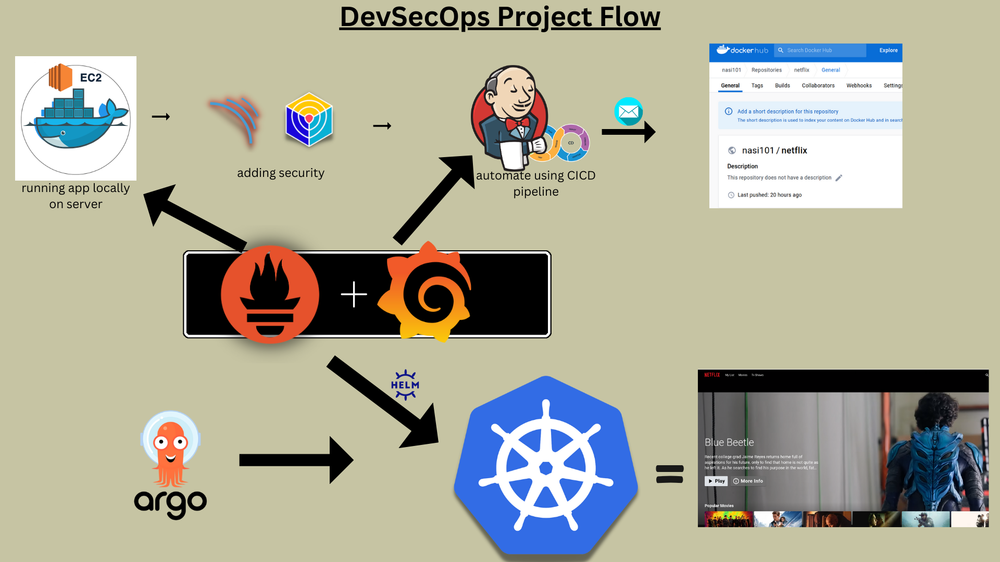
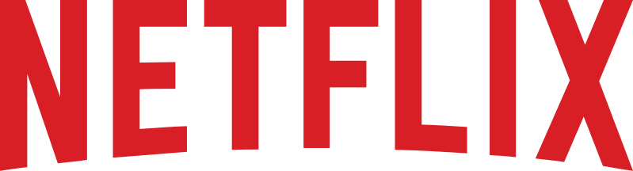
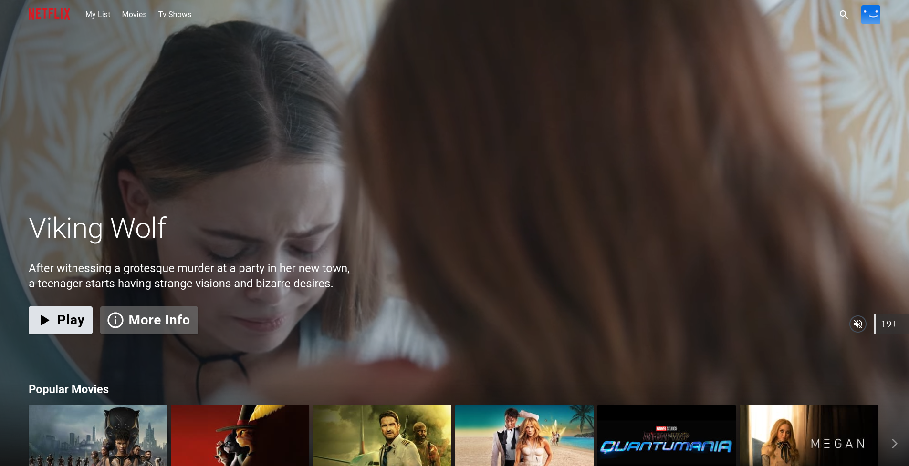

<div align="center">

  

  <br>

  <a href="http://netflix-clone-with-tmdb-using-react-mui.vercel.app/">
    
  </a>

</div>

<br>

<div align="center">

  

  <p align="center">Home Page</p>

</div>

<br>

# Netflix Clone – DevSecOps Project

A Netflix Clone built using React and integrated with a complete **DevSecOps CI/CD pipeline** using Jenkins, SonarQube, OWASP Dependency-Check, Trivy, Docker, Docker Hub, Helm, Argo CD, and AWS EKS.

## 🏗️ DevSecOps Architecture

<div align="center">

  

</div>

### Architecture Flow

```text
GitHub
   │
   ▼
Jenkins
   │
   ├── SonarQube Analysis
   │
   ├── OWASP Dependency Check
   │
   ├── Trivy Filesystem Scan
   │
   ├── Docker Build
   │
   ├── Trivy Image Scan
   │
   ├── Docker Push
   │
   └── Update Helm values.yaml
             │
             ▼
          GitHub
             │
             ▼
          Argo CD
             │
             ▼
          AWS EKS
             │
             ├── Netflix App
             │
             └── NGINX Ingress
                     │
                     ▼
                   Users
```

## 🚀 Technologies Used

* React
* Node.js
* Jenkins
* SonarQube
* OWASP Dependency-Check
* Trivy
* Docker
* Docker Hub
* Helm
* Argo CD
* AWS EKS
* NGINX Ingress
* GitHub

## 🔐 DevSecOps Pipeline

### 1. Source Code

The application source code, Dockerfile, and Helm chart are maintained in GitHub.

### 2. Continuous Integration

Jenkins checks out the source code and performs the following stages:

* Install dependencies
* SonarQube code analysis
* SonarQube Quality Gate
* OWASP Dependency-Check
* Trivy filesystem scan
* Docker image build
* Trivy Docker image scan
* Docker image push

### 3. Container Registry

After successful security scanning, the Docker image is pushed to **Docker Hub**.

### 4. GitOps Deployment

Jenkins updates the Docker image tag in the Helm `values.yaml` file.

Argo CD monitors the GitHub repository and synchronizes the updated Helm configuration with the AWS EKS cluster.

### 5. AWS EKS

The Netflix application is deployed into the EKS cluster using Helm.

NGINX Ingress provides the public entry point for users.

## 🛡️ Security Scanning

| Tool                   | Purpose                                            |
| ---------------------- | -------------------------------------------------- |
| SonarQube              | Static code analysis and Quality Gate              |
| OWASP Dependency-Check | Dependency vulnerability scanning                  |
| Trivy                  | Filesystem and Docker image vulnerability scanning |

## 🐳 Docker

The application is packaged into a Docker image and pushed to Docker Hub after successful security checks.

## ☸️ Kubernetes

The application is deployed to AWS EKS using Helm.

```text
AWS EKS
│
├── Argo CD
│
├── Netflix Application
│
└── NGINX Ingress
```

## 🔄 GitOps

The deployment flow follows the GitOps model:

```text
Jenkins
   │
   │ Update image tag
   ▼
GitHub
   │
   │ Watch repository
   ▼
Argo CD
   │
   │ Sync
   ▼
AWS EKS
   │
   ▼
Netflix Application
```

## 🌐 Live Application

<div align="center">

<a href="http://netflix-clone-with-tmdb-using-react-mui.vercel.app/">


</a>

</div>

---

<div align="center">

### Netflix Clone DevSecOps 🚀

Built with React • Docker • Jenkins • SonarQube • Trivy • Helm • Argo CD • AWS EKS

</div>
